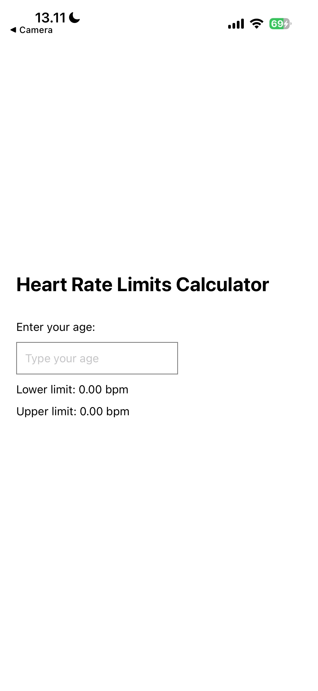
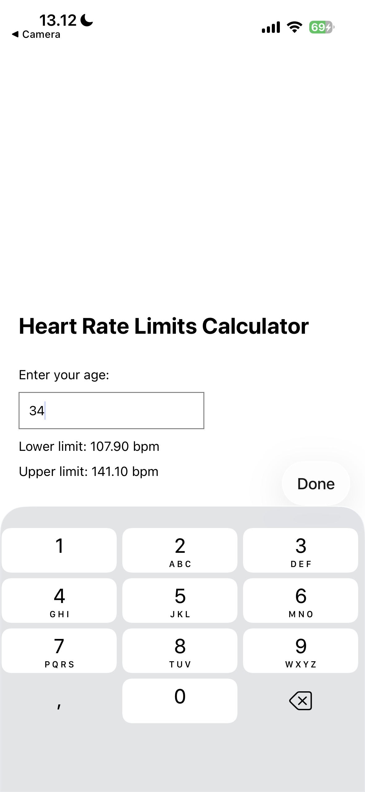

# Pulse Calculator
A minimal mobile application to calculate maximum and minimum pulse using user's age.

## 📱 Features
- Input your age to calculate:
    - Minimum pulse (safe lower bound)
    - Maximum pulse (safe upper bound)
- Clean and simple interface for mobile use
- Lightweight and beginner-friendly

## 🧮 How it Works
The calculator uses a basic formula:
\mathrm{Maximum\  Pulse}=220-\mathrm{Age}
\mathrm{Minimum\  Pulse}=\mathrm{Maximum\  Pulse}\times 0.5

## 🚀 Getting Started
Clone this repository, navigate to the project folder and run npx expo start.
You need Expo Go or another emulator. 

## 📸 Screenshots
Here is how PulseCalculator looks on a phone:

*Main input screen*

*Results showing minimum and maximum pulse*

## ⚠️ Disclaimer
This project is for educational purposes only. It should not be used as a substitute for professional medical advice.

## 📚 License 
MIT License - feel free to use, modify and share. 
=======
# Pulse Calculator
A minimal mobile application to calculate maximum and minimum pulse using user's age.

## 📱 Features
- Input your age to calculate:
    - Minimum pulse (safe lower bound)
    - Maximum pulse (safe upper bound)
- Clean and simple interface for mobile use
- Lightweight and beginner-friendly

## 🧮 How it Works
The calculator uses a basic formula:
\mathrm{Maximum\  Pulse}=220-\mathrm{Age}
\mathrm{Minimum\  Pulse}=\mathrm{Maximum\  Pulse}\times 0.5

## 🚀 Getting Started
Clone this repository, navigate to the project folder and run npx expo start.
You need Expo Go or another emulator. 

## 📸 Screenshots
Here is how PulseCalculator looks on a phone:

*Main input screen*

*Results showing minimum and maximum pulse*

## ⚠️ Disclaimer
This project is for educational purposes only. It should not be used as a substitute for professional medical advice.

## 📚 License 
MIT License - feel free to use, modify and share. 

